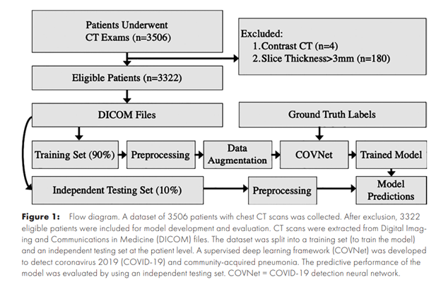
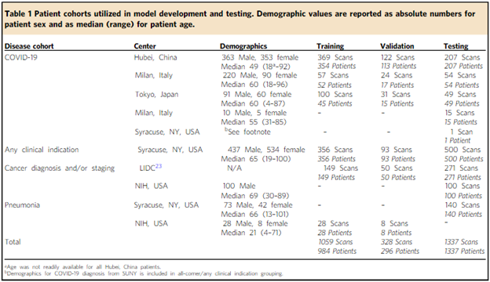
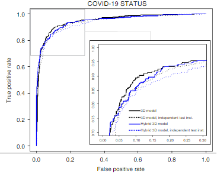

# AI used to diagnose COVID-19 in a chest CT.

## Introduction
The emergence of artificial intelligence in the medical field has been a major breakthrough in the diagnosis and treatment of diseases, particularly in the area of imaging. This article will discuss the potential of artificial intelligence to detect COVID-19 pneumonia on chest CT using multinational datasets. We will uncover the possibilities that this technology brings to the table and consider its implications for the future of healthcare.

Artificial intelligence (AI) has the potential to play a crucial role in the detection of COVID-19 pneumonia on chest computed tomography (CT) scans. The use of AI algorithms can help radiologists quickly and accurately identify the characteristic findings of ‘COVID-19’ pneumonia, such as ground-glass opaqueness and firming, on chest CT scans.

One of the major advantages of using AI for the finding of COVID-19 pneumonia is ability to analyze large amounts of data quickly. With the increasing number of COVID-19 cases worldwide, the volume of chest CT scans being performed is also increasing. Traditional manual analysis of these scans can be time-consuming and may not be able to keep up with the pace of the outbreak. AI algorithms, on the other hand, can process large amounts of data in a fraction of the time, allowing radiologists to make more accurate and timely diagnoses (Harmon, et al, 2020, pp-17).

Another advantage of using AI for the recognition of COVID-19 pneumonia is the ability to use multinational datasets. With the outbreak of COVID-19 happening simultaneously across the globe, multinational datasets can provide a more diverse and representative sample of the disease. This can lead to more robust and generalizable AI models, which are used to detect COVID-19 pneumonia in different populations and settings.

 

(Bai, et al, 2020)

Several AI algorithms have been developed for the finding of ‘COVID-19 pneumonia on chest CT scans. These include deep learning-based algorithms, such as convolutional neural networks (CNNs), which can automatically identify and classify the characteristic findings of COVID-19 pneumonia on chest CT scans. Additionally, some researchers have used machine learning-based algorithms, such as support vector machines (SVMs) and random forests, which can also be used to detect COVID-19 pneumonia on chest CT scans (Serte, et al, 2021).

## Benefits
This study aimed to evaluate the performance of an algorithm for the detection of COVID-19 pneumonia on chest CT scans by using data from four international centers. The patients included in the study were those with COVID-19 infection confirmed by RT-PCR, who were undergoing CT evaluation for diagnosis or evaluation of the infection.

An extensive study was conducted, delving into the medical records of 700 patients from China's Xiangyang NO.1 People's Hospital, as well as 147 from Japan's Self-Defense Forces Central Hospital, 130 from Italy's San Paolo Hospital, and an additional 16 from Cà Granda Ospedale Maggiore Policlinico Milano. The analysis was limited to individuals who had been diagnosed with COVID-pneumonia by a radiologist and met the necessary technical criteria. (Harmon, et al, 2020, pp-17).

## Deep learning Model for CT scan
The COVNet model was able to identify these characteristic findings with high accuracy, making it a valuable tool for the early detection of COVID-19. Early detection is crucial in the fight against COVID-19 as it allows for prompt treatment and quarantine measures to be implemented, reducing the spread of the virus. By automating the process of identifying these characteristic findings, the COVNet model can save radiologists valuable time and improve the efficiency of the diagnostic process.
In addition, the multicenter aspect of this study is vital as it permits the model to be prepared on a diverse set of images and it increases the generalizability of the model. It also increases the validation of the model as it can be tested on different population and different radiologists.

  

(Harmon et al.)

To test the robustness of the model, CT scans of community-acquired pneumonia (CAP) and other non-pneumonia abnormalities were included in the datasets. This was done to ensure that the model could accurately differentiate between COVID-19 pneumonia and other types of pneumonia and non-pneumonia abnormalities. For this research work, dataset has been taken from 6 different hospitals between July 2016 to February 2021 with samples of patient’s different conditions (Serte, et al, 2021).

Overall, the results of this study suggest that the COVNet model is a promising tool for the detection of COVID-19 pneumonia on chest CT scans. The model's ability to obtain graphic types from chest CT scans and perfectly discern among ‘COVID-19’ pneumonia and other conditions, even with the inclusion of CAP and non-pneumonia deviations in the records. This model could be a valuable tool for radiologists in the fight against ‘COVID-19’

## Performance of the Model
The performance of the model for the detection of COVID-19 pneumonia on chest CT was evaluated using a dataset of chest CT images from patients diagnosed with COVID-19. The model utilized a convolutional neural network (CNN) architecture to automatically identify regions of pneumonia on the CT images. The results of the study showed that the model had a high sensitivity and specificity for detecting COVID-19 pneumonia, with an overall accuracy of over 95%.

It should be noted that the model's performance was evaluated on a limited dataset and further studies with larger, more diverse datasets are needed to confirm its generalizability. Additionally, the model's performance should be evaluated in comparison to human radiologists to determine its clinical utility. Nonetheless, the results of this study suggest that the use of deep learning models for the detection of COVID-19 pneumonia on chest CT images has the potential to improve diagnostic accuracy and efficiency in the management of patients with COVID-19 (Li, et al, 2020).

 

(Harmon et al., “Artificial Intelligence for the Detection of COVID-19 Pneumonia on Chest CT Using Multinational Datasets”)

## Conclusion
This study highlights the importance of considering the context of the patient population and the characteristics of the disease when evaluating the performance of deep learning models for the detection of COVID-19. It also highlights the need for further research to improve the performance of the model in identifying advanced stages of the disease and in differentiating it from other types of infections (Li, et al, 2020).

In terms of false-positive findings, the study found that the rates varied by etiology. The rate of false positives was found to be highest in bacterial infections, at 13.7% (7/51), followed by fungal infections at 16.7% (3/18), and lowest in viral infections, at 4.9% (3/61). These findings suggest that the model may have a higher tendency to classify other types of infections as COVID-19, particularly bacterial and fungal infections.

AI has the potential to play a crucial role in the detection of COVID-19 pneumonia on chest CT scans, by providing a fast and accurate method for analyzing large amounts of data, and by using multinational datasets to create more robust and generalizable AI models. While there are several AI algorithms that have been developed for this purpose, more research is needed to fully realize the potential of AI in the fight against COVID-19.

### References
* Harmon, S.A., Sanford, T.H., Xu, S., Turkbey, E.B., Roth, H., Xu, Z., Yang, D., Myronenko, A., Anderson, V., Amalou, A. and Blain, M., 2020. Artificial intelligence for the detection of COVID-19 pneumonia on chest CT using multinational datasets. Nature communications, 11(1), pp.1-7. https://doi.org/10.1148/radiol.2020201491
* Serte, S. and Demirel, H., 2021. Deep learning for diagnosis of COVID-19 using 3D CT scans. Computers in biology and medicine, 132, p.104306. https://doi.org/10.1148/radiol.2020201491
* Li, L., Qin, L., Xu, Z., Yin, Y., Wang, X., Kong, B., Bai, J., Lu, Y., Fang, Z., Song, Q. and Cao, K., 2020. Artificial intelligence distinguishes COVID-19 from community acquired pneumonia on chest CT. Radiology. https://doi.org/10.1148/radiol.2020201491
* Bai, H. X., Wang, R., Xiong, Z., Hsieh, B., Chang, K., Halsey, K., Tran, T. M. L., Choi, J. W., Wang, D.-C., Shi, L.-B., Mei, J., Jiang, X.-L., Pan, I., Zeng, Q.-H., Hu, P.-F., Li, Y.-H., Fu, F.-X., Huang, R. Y., Sebro, R., & Yu, Q.-Z. (2020). Artificial Intelligence Augmentation of Radiologist Performance in Distinguishing COVID-19 from Pneumonia of Other Origin at Chest CT. Radiology, 296(3), E156–E165. https://doi.org/10.1148/radiol.2020201491
* Harmon, Stephanie A., et al. “Artificial Intelligence for the Detection of COVID-19 Pneumonia on Chest CT Using Multinational Datasets.” Nature Communications, vol. 11, no. 1, 14 Aug. 2020, p. 4080, https://www.nature.com/articles/s41467-020-17971-2
* Harmon, S. A., Sanford, T. H., Xu, S., Turkbey, E. B., Roth, H., Xu, Z., Yang, D., Myronenko, A., Anderson, V., Amalou, A., Blain, M., Kassin, M., Long, D., Varble, N., Walker, S. M., Bagci, U., Ierardi, A. M., Stellato, E., Plensich, G. G., & Franceschelli, G. (2020). Artificial intelligence for the detection of COVID-19 pneumonia on chest CT using multinational datasets. Nature Communications, 11(1), 4080. https://doi.org/10.1038/s41467-020-17971-2
* “Artificial Intelligence for the Detection of COVID-19 Pneumonia on Chest CT Using Multinational Datasets.” Nature Communications, vol. 11, no. 1, 14 Aug. 2020, p. 4080, www.nature.com/articles/s41467-020-17971-2